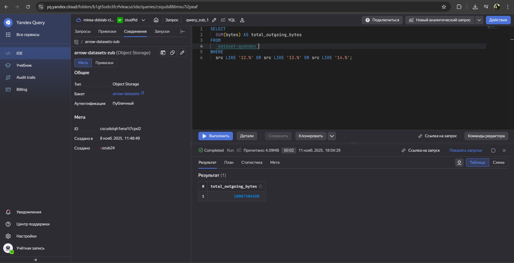
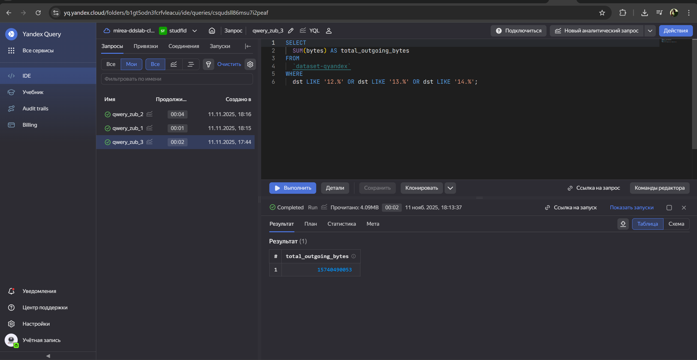

# Использование технологии Yandex Query для анализа данных сетевой
активности
vszub24@yandex.ru

## Цель работы

1.  Изучить возможности технологии Yandex Query для анализа
    структурированных наборов данных
2.  Получить навыки построения аналитического пайплайна для анализа
    данных с помощью сервисов Yandex Cloud
3.  Закрепить практические навыки использования SQL для анализа данных
    сетевой активности в сегментированной корпоративной сети

## Исходные данные

1.  Программное обеспечение ОС Windows 11 Pro
2.  RStudio
3.  Интерпретатор языка R 4.5.1

## План

1.  Используя сервис Yandex Query настроить доступ к данным, хранящимся
    в сервисе хранения данных Yandex Object Storage.
2.  Проверьте доступность данных (файл yaqry_dataset.pqt) в бакете
    arrow-datasets S3 хранилища Yandex Object Storage.
3.  Известно, что IP адреса внутренней сети начинаются с октетов,
    принадлежащих интервалу \[12-14\]. Определите количество хостов
    внутренней сети, представленных в датасете.
4.  Определите суммарный объем исходящего трафика.
5.  Определите суммарный объем входящего трафика.

## Шаги:

### Загрузка библиотек

``` r
options(repos = c(CRAN = "https://mirror.truenetwork.ru/CRAN/"))
install.packages("arrow")
```

    Устанавливаю пакет в 'D:/Rlib'
    (потому что 'lib' не определено)

    пакет 'arrow' успешно распакован, MD5-суммы проверены

    Скачанные бинарные пакеты находятся в
        D:\Rtemp\RtmpiOEXNU\downloaded_packages

``` r
install.packages("dplyr")
```

    Устанавливаю пакет в 'D:/Rlib'
    (потому что 'lib' не определено)

    пакет 'dplyr' успешно распакован, MD5-суммы проверены

    Warning: не могу удалить прежнюю установку пакета 'dplyr'

    Warning in file.copy(savedcopy, lib, recursive = TRUE): проблема с копированием
    D:\Rlib\00LOCK\dplyr\libs\x64\dplyr.dll в D:\Rlib\dplyr\libs\x64\dplyr.dll:
    Permission denied

    Warning: восстановлен 'dplyr'


    Скачанные бинарные пакеты находятся в
        D:\Rtemp\RtmpiOEXNU\downloaded_packages

``` r
library(arrow)
```

    Warning: пакет 'arrow' был собран под R версии 4.5.2


    Присоединяю пакет: 'arrow'

    Следующий объект скрыт от 'package:utils':

        timestamp

``` r
library(dplyr)
```

    Warning: пакет 'dplyr' был собран под R версии 4.5.2


    Присоединяю пакет: 'dplyr'

    Следующие объекты скрыты от 'package:stats':

        filter, lag

    Следующие объекты скрыты от 'package:base':

        intersect, setdiff, setequal, union

### Импортируйте данные в R.

``` r
dataset_url <- "https://storage.yandexcloud.net/arrow-datasets/yaqry_dataset.pqt"
local_filename <- "yaqry_dataset.pqt"
if (!file.exists(local_filename)) {
  download.file(url = dataset_url, destfile = local_filename, mode = "wb")
}
network_data <- open_dataset(local_filename, format = "parquet")
```

### Определите количество хостов внутренней сети, представленных в датасете.

``` r
unique_internal_src <- network_data %>%
  filter(grepl("^(12|13|14)", src)) %>%
  distinct(src) %>%
  select(host = src)
unique_internal_dst <- network_data %>%
  filter(grepl("^(12|13|14)", dst)) %>%
  distinct(dst) %>%
  select(host = dst)
all_unique_internal_hosts <- union(unique_internal_src, unique_internal_dst)
num_internal_hosts <- all_unique_internal_hosts %>%
  count() %>%
  pull(n)
```

    Warning: Default behavior of `pull()` on Arrow data is changing. Current behavior of returning an R vector is deprecated, and in a future release, it will return an Arrow `ChunkedArray`. To control this:
    ℹ Specify `as_vector = TRUE` (the current default) or `FALSE` (what it will change to) in `pull()`
    ℹ Or, set `options(arrow.pull_as_vector)` globally
    This warning is displayed once every 8 hours.

``` r
num_internal_hosts
```

    [1] 1000


###Определите суммарный объем исходящего трафика.

``` r
total_outgoing_bytes <- network_data %>%
  filter(grepl("^(12|13|14)", src)) %>%
  summarise(total = sum(bytes, na.rm = TRUE)) %>%
  pull(total)
total_outgoing_bytes
```

    integer64
    [1] 10007506588



### Определите суммарный объем входящего трафика.

``` r
total_ingoing_bytes <- network_data %>%
  filter(grepl("^(12|13|14)", dst)) %>%
  summarise(total = sum(bytes, na.rm = TRUE)) %>%
  pull(total)
total_ingoing_bytes
```

    integer64
    [1] 15740490053



## Оценка результата

В рамках практческой работы были проведены исследования публичного
датасета реализованы ответы на поставленные вопросы, проверкой
корректности при помощи средств языка R

## Вывод

В практической работе были изучены возможности технологии Yandex Query
для анализа структурированных наборов данных,получены навыки построения
аналитического пайплайна для анализа данных с помощью сервисов Yandex
Cloud и закрепдены практические навыки использования SQL для анализа
данных сетевой активности в сегментированной корпоративной сети
